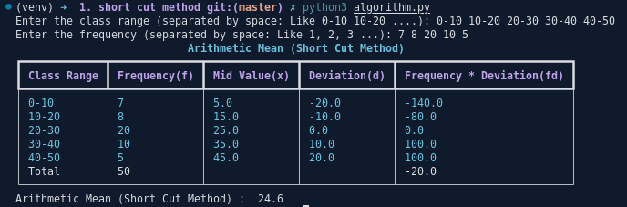

### Arithmetic Mean (AM) (Short Cut Method)

#### Formula
```math 
A.M = a + \frac{\sum fd}{\sum f}
```
Where,
- `a` is the assumed mean
- `fd` is the frequency distribution
- `f` is the frequency
  

#### Problem 1
Find the arithmetic mean for the following distribution :

| Class Interval | 0-10 | 10-20 | 20-30 | 30-40 | 40-50 |
| :---: | :---: | :---: | :---: | :---: | :---: |
| Frequency | 7 | 8 | 20 | 10 | 5 |

##### Solution
Let us assume `a = 25`

| Class | Mid Value (x) | Frequency (f) | d = x - a | fd |
| :---: | :---: | :---: | :---: | :---: |
| 0-10 | 5 | 7 | -20 | -140 |
| 10-20 | 15 | 8 | -10 | -80 |
| 20-30 | 25 | 20 | 0 | 0 |
| 30-40 | 35 | 10 | 10 | 100 |
| 40-50 | 45 | 5 | 20 | 100 |
| Total | - | 50 | - | -20 |

```math
A.M = a + \frac{\sum fd}{\sum f}
```
```math
A.M = 25 + \frac{-20}{50}
```
```math
A.M = 25 - 0.4
```
```math
A.M = 24.6
```
#### Output
